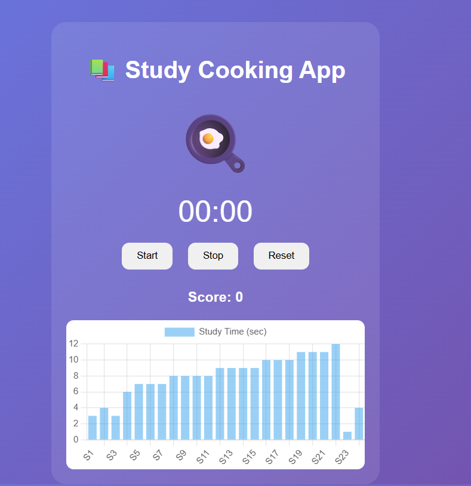

# 🍳 Study Cooking Timer

A fun productivity web app that tracks study time like cooking.

## 🚀 Features
- ⏱️ Real-time study timer
- 🍞 Undercooked / 🍳 Perfect / 🔥 Overcooked feedback
- 🎯 Score system
- 📊 Study progress chart
- 💾 Data stored using localStorage

## 🛠️ Tech Stack
- HTML
- CSS
- JavaScript
- Chart.js

## 📷 Preview

## ▶️ How to Run
1. Download the project
2. Open index.html in browser

## 📌 Future Improvements
- 📱 Mobile app version
- 🔔 Study reminders
- 🌙 Dark mode

## 👤 Author
Your Name
